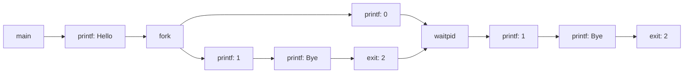

> # 《CSAPP》

Course Schedule: <http://www.cs.cmu.edu/afs/cs/academic/class/15213-f15/www/schedule.html>

Labs Link: <http://csapp.cs.cmu.edu/3e/labs.html>

Code Examples: http://csapp.cs.cmu.edu/public/code.html

CSAPP file content: http://csapp.cs.cmu.edu/2e/ics2/code/src/csapp.c

Reference: <https://www.jianshu.com/nb/35143394>


# 第8章 异常控制流

这一章节的内容是为了最终实现一个shell做准备的，最好是先去做CS-631 APUE的project，能够显著降低CSAPP里的shell lab的难度。


### 8.4.3 回收子进程


 **6.使用`waitpid()`**

```c
#include <stdio.h>
#include <sys/types.h>
#include <sys/wait.h>
#include <unistd.h>
#include <errno.h>
#include <string.h>
#include <stdlib.h>

#define N 2

void unix_error(const char *s)
{
    fprintf(stderr, "%s: %s\n", s, strerror(errno));
    exit(EXIT_FAILURE);
}

pid_t Fork()
{
    pid_t pid;
    if ((pid = fork()) < 0) {
        unix_error("fork error");
    }

    return pid;
}

int main()
{
    int status;
    pid_t pid;

    //create N children
    for (int i = 0; i < N; ++i) {
        if ((pid = Fork()) == 0) {
            exit(100 + i);
        }
    }

    //parent reaps N children in no particular order
    while ((pid = waitpid(-1, &status, 0)) > 0) {
        if (WIFEXITED(status)) {
            printf("child %d terminated normally with exit status = %d\n", (int)pid, WEXITSTATUS(status));
        }
        else {
            printf("child %d terminated abnormally\n", (int)pid);
        }
    }

    if (errno != ECHILD) {
        unix_error("waitpid error");
    }

    return 0;
}
```

```bash
child 618 terminated normally with exit status = 100
child 619 terminated normally with exit status = 101
```

用一个`while`循环来回收子进程，当所有子进程被回收之后，再调用`waitpid`就返回-1，并设置`errno`为`ECHILD`。虽然看结果好像是顺序回收子进程的，实际上是不确定的，因为我们把`waitpid`第一个参数设为-1，实际上只要有一个子进程返回，`waitpid`就会产生返回值。

如果向按照特定顺序回收子进程：

```c
#include <stdio.h>
#include <sys/types.h>
#include <sys/wait.h>
#include <unistd.h>
#include <errno.h>
#include <string.h>
#include <stdlib.h>

#define N 2

void unix_error(const char *s)
{
    fprintf(stderr, "%s: %s\n", s, strerror(errno));
    exit(EXIT_FAILURE);
}

pid_t Fork()
{
    pid_t pid;
    if ((pid = fork()) < 0) {
        unix_error("fork error");
    }

    return pid;
}

int main()
{
    int status;
    pid_t pid[N], tmpPid;

    //create N children
    for (int i = 0; i < N; ++i) {
        if ((pid[i] = Fork()) == 0) {
            exit(100 + i);
        }
    }

    //parent reaps N children in no particular order
    int cnt = 0;
    while ((tmpPid = waitpid(pid[cnt++], &status, 0)) > 0) {
        if (WIFEXITED(status)) {
            printf("child %d terminated normally with exit status = %d\n", (int)tmpPid, WEXITSTATUS(status));
        }
        else {
            printf("child %d terminated abnormally\n", (int)tmpPid);
        }
    }

    if (errno != ECHILD) {
        unix_error("waitpid error");
    }

    return 0;
}
```

```bash
child 628 terminated normally with exit status = 100
child 629 terminated normally with exit status = 101
```

**练习题8.4**

考虑下面程序的输出

```c
#include <stdio.h>
#include <sys/types.h>
#include <sys/wait.h>
#include <unistd.h>
#include <errno.h>
#include <string.h>
#include <stdlib.h>

#define N 2

void unix_error(const char *s)
{
    fprintf(stderr, "%s: %s\n", s, strerror(errno));
    exit(EXIT_FAILURE);
}

pid_t Fork()
{
    pid_t pid;
    if ((pid = fork()) < 0) {
        unix_error("fork error");
    }

    return pid;
}

int main()
{
    int status;
    pid_t pid;

    printf("%s\n", "Hello");
    pid = Fork();
    printf("%d\n", !pid);

    if (pid) {
        if (waitpid(-1, &status, 0) > 0) {
            if (WIFEXITED(status)) {
                printf("%d\n", WEXITSTATUS(status));
            }
        }
    }

    printf("%s\n", "Bye");
    exit(2);
}
```



画出进程图即可，数一数`printf`的数量，输出是6行。

```bash
Hello
0
1
Bye
2
Bye
```

子进程里输出1必须在`Bye`的前面，输出0的顺序可以是`0, 1, Bye`或`1, 0, Bye`或`1, Bye, 0`，只有这三种情况。

### 8.4.4 让进程休眠

```c
#include <unistd.h>
unsigned int sleep(unsigned int secs);
//返回还要继续休眠的秒数
```

如果休眠的时间到了，返回0，否则返回还要继续休眠的秒数。后一种情况在被一个信号中断的情况下可能发生。

**练习题8.5**

编写一个`sleep`的包装函数，相比于`sleep`多了一个输出信息。

思路其实就是用一个变量`timeLeft`记录还需要休眠的时间，则`secs`与`timeLeft`的差值就是实际休眠的时间

```c
#include <unistd.h>
#include <stdio.h>

unsigned int snooze(unsigned int secs)
{
    unsigned int timeLeft = sleep(secs);
    printf("Slept for %d of %d secs.\n", (int)(secs - timeLeft), (int)secs);
    
    return timeLeft
}
```

### 8.4.5 加载并运行程序

`execve`函数在当前进程的上下文中加载并运行一个新程序。

```c
#include <unistd.h>

int execve(const char *filename, const char *argv[], const char *envp[]);
//成功不返回，错误返回-1
```

**练习题8.6**

编写程序打印命令行参数和环境变量。

```c
#include <stdio.h>
#include <sys/types.h>
#include <sys/wait.h>
#include <unistd.h>
#include <errno.h>
#include <string.h>
#include <stdlib.h>


int main(int argc, char **argv, char **envp)
{
    printf("Command line arguments: \n");

    for (int i = 0; i < argc; ++i)
        printf("\targv[%2d]: %s\n", i, argv[i]);

    printf("\n");
    printf("Environment variables: \n");

    for (int i = 0; envp[i] != NULL; ++i)
        printf("\tenvp[%2d]: %s\n", i, envp[i]);

    return 0;
}
```

### 8.4.6 利用`fork`和`execve`运行程序


## 8.5 信号

### 8.5.2 发送信号

**4.用`kill`函数发送信号**

```c
#include <sys/types.h> /* pid_t declared here */
#include <signal.h>

int kill(pid_t pid, int sig); //成功返回0，错误返回-1
```

相比于书中的程序，相当于把`csapp.h`和`csapp.c`里的部分内容提取出来合写到一个程序里面了。

```c
#include <stdio.h>
#include <sys/types.h>
#include <sys/wait.h>
#include <unistd.h>
#include <errno.h>
#include <string.h>
#include <stdlib.h>
#include <signal.h>

void unix_error(char *msg)
{
    fprintf(stderr, "%s: %s\n", msg, strerror(errno));
    exit(0);
}

pid_t Fork()
{
    pid_t pid = fork();
    if (pid < 0) unix_error("fork error");
    return pid;
}

void Kill(pid_t pid, int signum) 
{
    int rc;
    if ((rc = kill(pid, signum)) < 0) unix_error("Kill error");
}


int main(int argc, char **argv, char **envp)
{
    pid_t pid;

    if ((pid = Fork()) == 0) {
        pause();
        printf("control should never reach here!\n");
        exit(0);
    }

    Kill(pid, SIGKILL);

    return 0;
}
```


# 第九章 虚拟内存


# 第九章 虚拟内存

这一章结合《现代操作系统》理解。